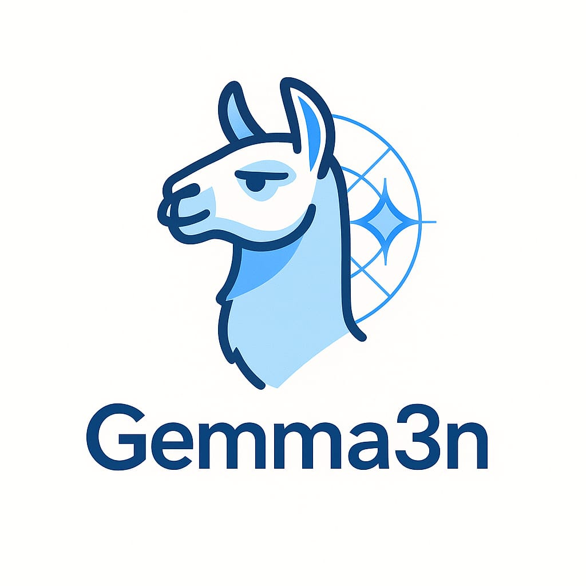
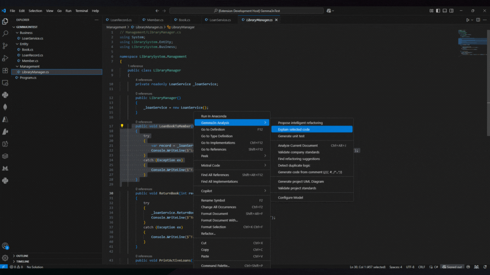
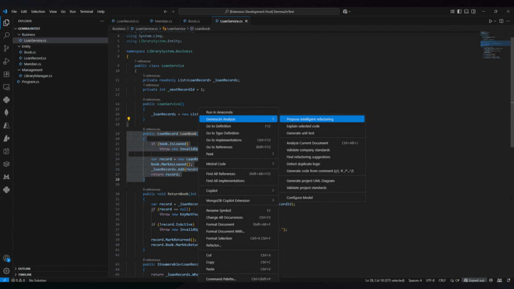
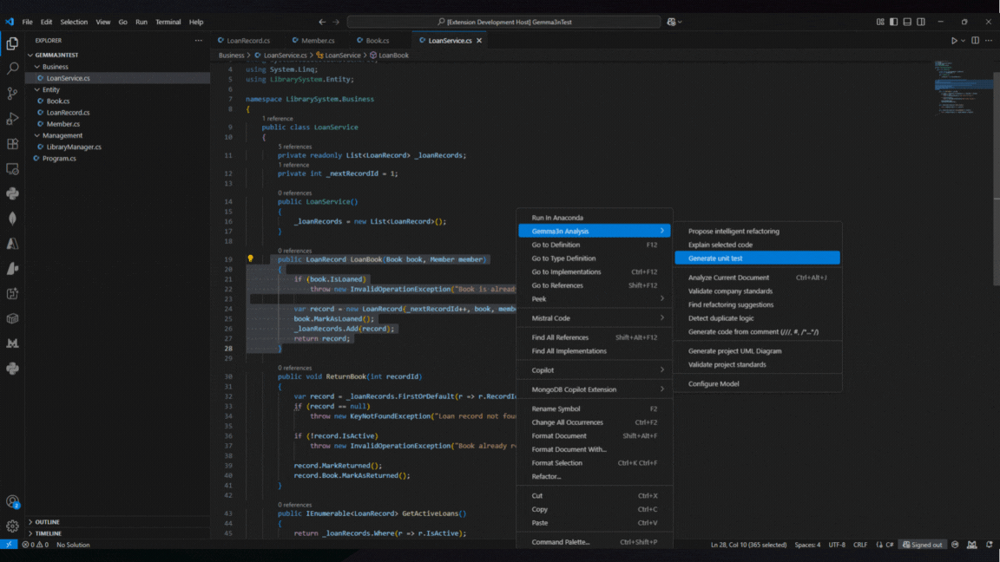
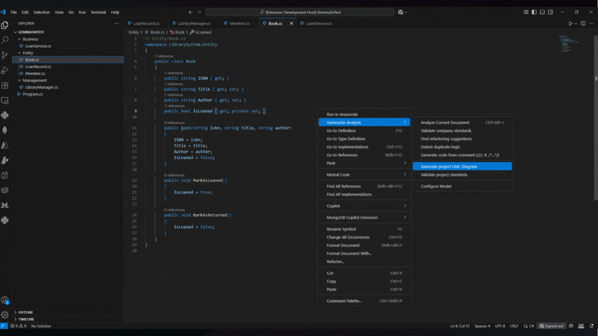
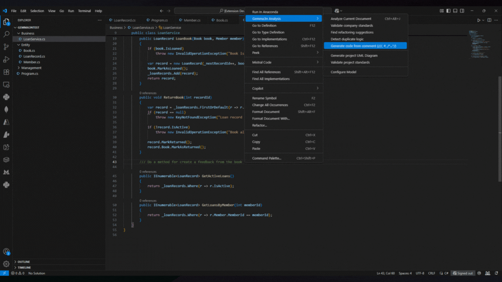
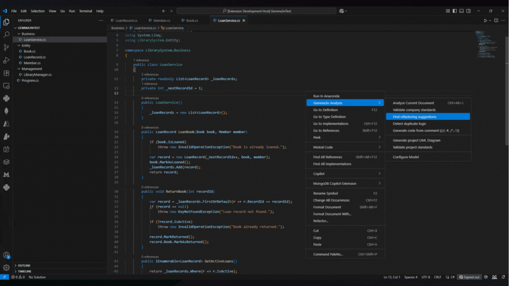
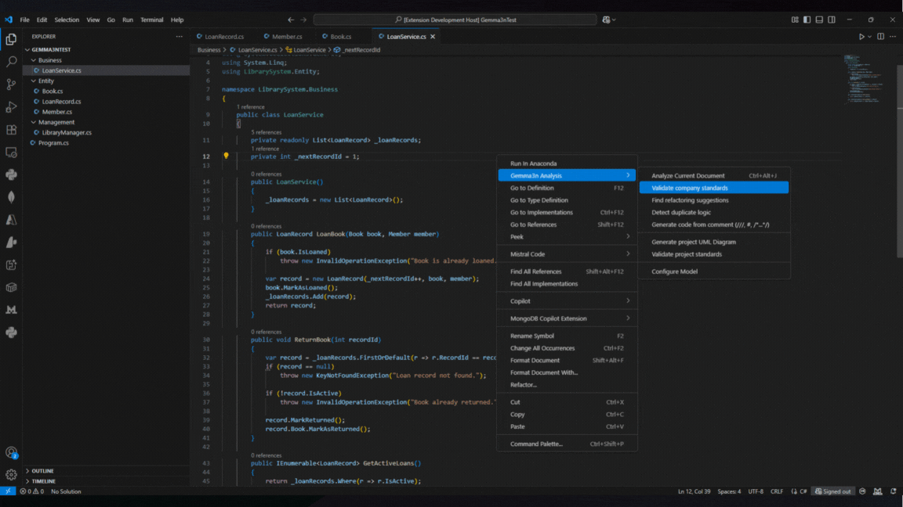
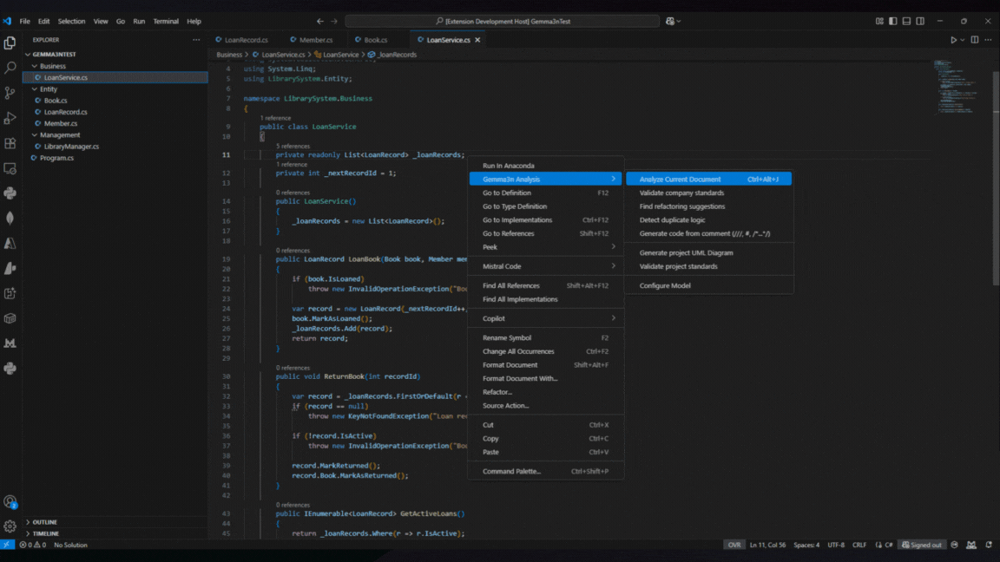

# Ollama Code Analyzer 🚀  
**Your Private, Offline-First AI Co-pilot for Visual Studio Code**  

[](LICENSE)  
  
  
  

<p align="center">
  <br>
</p>

Run AI-powered code analysis directly inside your editor — **fully offline, private, and secure**.  
Ollama Code Analyzer uses on-device AI models (like `gemma3n`) via [Ollama](https://ollama.com/) to help you:  

- 🔍 Analyze code quality and detect subtle bugs  
- ♻️ Refactor intelligently  
- 📝 Generate functions from comments  
- 🧪 Create unit tests automatically  
- 📚 Explain complex code in seconds  
- 📊 Visualize your project with UML diagrams  

---

## 📑 Table of Contents
- [✨ Why Ollama Code Analyzer?](#-why-ollama-code-analyzer)
- [📦 Quick Setup](#-quick-setup)
- [💻 Core Commands](#-core-commands)
- [⚙️ Configuration](#️-configuration)
- [📸 Screenshots & Demo](#-screenshots--demo)
- [🛠 Troubleshooting](#-troubleshooting)
- [🤝 Contributing](#-contributing)
- [📜 License](#-license)

---

## ✨ Why Ollama Code Analyzer?
In today’s development landscape, AI assistants are becoming indispensable — but most require sending your code to the cloud.  
With **Ollama Code Analyzer**, you get the **power of AI with complete privacy**:

- 🛡 **Private by Design** – Runs entirely on your machine. No cloud. No leaks.  
- 📶 **Offline-First** – Works without internet. Ideal for remote work or travel.  
- 🐞 **Deep Bug Detection** – Finds subtle logic errors missed by traditional linters.  
- ⚡ **Code Generation from Comments** – Write `///` or `#` followed by your intent — AI writes the function.  
- 🔄 **Context-Aware Refactoring** – Improves performance, readability, and maintainability.  
- 📚 **Instant Code Explanation** – Understand unfamiliar code instantly.  
- 🧪 **Automated Unit Test Creation** – Uses frameworks like Jest or pytest.  
- 🗺 **UML Visualization** – Generates PlantUML diagrams for your whole project.  

---

## 📦 Quick Setup

### 1️⃣ Install Graphviz (for UML Diagrams)
To generate UML diagrams, the extension uses PlantUML, which requires Graphviz to be installed on your system.

**Windows (using Chocolatey):**
```bash
choco install graphviz
```

**Linux (Debian/Ubuntu):**
```bash
_sudo apt-get install graphviz
```

**macOS (using Homebrew):**
```bash
brew install graphviz
```

### 2️⃣ Install Ollama
Download from [ollama.com](https://ollama.com/download) for your OS.

### 3️⃣ Download a Model
```bash
# Example: Pull the Gemma3n latest model
ollama pull gemma3n:latest
```
> 💡 You can also try `gemma3n:e2b` or other coding-optimized models.

### 3️⃣ Install the Extension
```bash
# Install dependencies
npm install

# Package into a VSIX file
vsce package

# Install into VS Code
code --install-extension ollama-code-analyzer-*.vsix
```
Reload VS Code, and you’re ready! 🎉  

---

## 💻 Core Commands
All commands are available via **Command Palette** (`Ctrl+Shift+P`) → search **"Ollama Code Analyzer"** or right-click in the editor.

| Command                  | Description |
|--------------------------|-------------|
| **Smart Refactor**       | Refactor selected code intelligently. |
| **Explain Code**         | Explain the purpose & logic of code. |
| **Generate Unit Test**   | Create test files automatically. |
| **Analyze File/Project** | Deep static + AI-based analysis. |
| **Generate UML Diagram** | Create PlantUML architecture diagram. |

---

## ⚙️ Configuration
Settings in **VS Code → Settings → Extensions → Ollama Code Analyzer**:

| Setting | Default | Description |
|---------|---------|-------------|
| `ollamaCodeAnalyzer.baseUrl` | `http://localhost:11434` | API endpoint for your local Ollama service. |
| `ollamaCodeAnalyzer.model` | `gemma3n:latest` | AI model to use (must be pulled via Ollama). |
| `ollamaCodeAnalyzer.outputLanguage` | `English` | Response language (`English` or `Español`). |

---

## 📸 Screenshots & Demo
---

  <div style="display:grid; gap:2rem; max-width:800px; margin:0 auto;">
    <div>
      <p style="text-align:center;">
        
      </p>
      <p><strong>Explain Code:</strong> Automatically breaks down and explains sections of source code, helping developers understand complex logic or unfamiliar codebases quickly.</p>
    </div>
    <div>
      <p style="text-align:center;">
        
      </p>
      <p><strong>Intelligent Refactoring:</strong> Suggests smarter, context-aware refactorings to improve code structure, readability, and maintainability without changing behavior.</p>
    </div>
    <div>
      <p style="text-align:center;">
        
      </p>
      <p><strong>Duplicate Logic:</strong> Detects repeating or redundant logic across the codebase so you can consolidate and DRY-up your implementation.</p>
    </div>
    <div>
      <p style="text-align:center;">
        
      </p>
      <p><strong>Unit Test:</strong> Demonstrates automated or assisted generation/execution of unit tests to ensure code correctness and guard against regressions.</p>
    </div>
    <div>
      <p style="text-align:center;">
        
      </p>
      <p><strong>Project UML Diagram:</strong> Visualizes the structure of your project by generating UML diagrams from code, aiding in architecture comprehension and documentation.</p>
    </div>
    <div>
      <p style="text-align:center;">
        
      </p>
      <p><strong>Project Standard:</strong> Checks code against defined project standards and conventions, highlighting deviations to enforce consistency.</p>
    </div>
    <div>
      <p style="text-align:center;">
        
      </p>
      <p><strong>Code From Comment:</strong> Generates implementation code based on developer comments or specifications, speeding up prototyping and reducing boilerplate.</p>
    </div>
    <div>
      <p style="text-align:center;">
        
      </p>
      <p><strong>Refactoring Suggestions:</strong> Offers targeted recommendations to improve code quality, such as simplifying logic, renaming for clarity, or extracting methods.</p>
    </div>
    <div>
      <p style="text-align:center;">
        
      </p>
      <p><strong>Validate Company Standard:</strong> Ensures code complies with organizational or regulatory standards, flagging violations before they reach production.</p>
    </div>
    <div>
      <p style="text-align:center;">
        
      </p>
      <p><strong>Analyze Document:</strong> Performs analysis on documentation or code comments to extract actionable insights, detect inconsistencies, or summarize content.</p>
    </div>
  </div>
---

## 🛠 Troubleshooting
- **Ollama service not running** → Ensure you have started Ollama (`ollama serve`).  
- **Model not found** → Pull the model before using: `ollama pull gemma3n:latest`.  
- **VSIX not installing** → Make sure VS Code version supports local extensions.  

---

## 🤝 Contributing
Contributions are welcome!  
1. Fork this repo  
2. Create a feature branch (`git checkout -b feature/my-feature`)  
3. Commit changes (`git commit -m "Add my feature"`)  
4. Push (`git push origin feature/my-feature`)  
5. Open a Pull Request  

---

## 📜 License
This project is licensed under **CC0 1.0 Universal** – public domain dedication.  
See the [LICENSE](LICENSE) file for details.  
